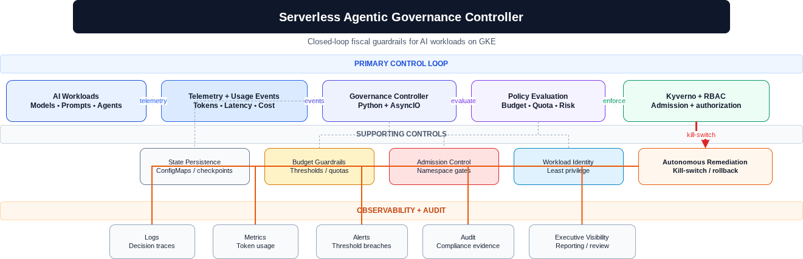

# Serverless Agentic Governance Controller

## Overview
An autonomous, event-driven SRE platform designed to enforce fiscal guardrails on AI-driven Kubernetes workloads. This project demonstrates real-time observability, automated budget remediation, and policy-as-code enforcement on GKE.

## Architecture

    AG -- "1. Logs Event" --> CM
    GC -- "2. Polls State" --> CM
    GC -- "3. Calculates Spend" --> GC
    GC -- "4. Threshold Breach" --> K8S
    K8S -- "5. Kill/Scale Command" --> TG
    GC -- "6. Emit Telemetry" --> Logs

## Key Features
- **Fiscal SecOps:** Real-time token/cost tracking for LLM tool executions.
- **Autonomous Remediation:** Automated kill-switch logic integrated with the Kubernetes API to terminate budget-breaching pods.
- **Policy Compliance:** Built to enforce enterprise security standards using Kyverno (RBAC, namespace labels, and Workload Identity).
- **Resilient Polling:** Decoupled event processing using Kubernetes ConfigMaps, ensuring state-persistence across pod restarts.

## Technology Stack
- **Languages:** Python (AsyncIO, httpx, kubernetes-client)
- **Infrastructure:** Google Kubernetes Engine (GKE), Google Cloud Build
- **Governance:** Kyverno (Policy Engine), RBAC (Role-Based Access Control)
- **Observability:** Structured JSON logging, automated alerting pipeline

## Getting Started
### Prerequisites
- GKE Cluster with Workload Identity enabled.
- Kyverno installed for policy enforcement.

### Deployment
1. **Create Secrets:** `kubectl create secret generic governance-secrets ...`
2. **Apply RBAC:** `kubectl apply -f k8s/litellm/governance-rbac.yaml`
3. **Deploy Controller:** `kubectl apply -f k8s/litellm/governance-controller.yaml`

---
## Connect
**Brian Lasky** | Cloud Architect & SRE
*Specializing in Agentic Infrastructure, Fiscal Governance, and Scalable Cloud Systems.*

- [Website](https://brian-lasky.com)
- [LinkedIn](https://www.linkedin.com/in/brian-lasky-67464086/)
- [GitHub](https://github.com/brianmlasky)

---
## Project Highlights
*Engineered to solve the "Token Runaway" problem in high-scale AI inference environments.*
